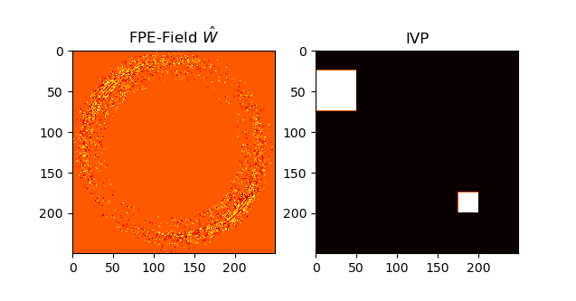
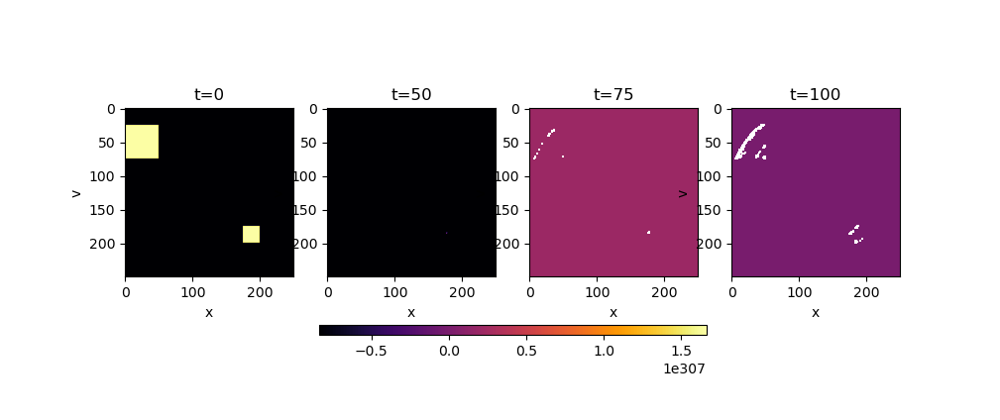

### Lösen der Fokker-Planck-Gleichung

Ich will die Fokker-Planck-Gleichung lösen:

=\hat{W}\cdot%20p(\vec{x},t%2B\tau|\vec{x},t)})

mit

}(\vec{x},t)%2B\sum_{ij}%20+%20\frac{\partial}{\partial%20x_ix_j}D_ij^{(2)}(\vec{x},t))})

Dazu muss ich erstmal W berechnen, was ich als beim harmonischen Oszillator als "FPE-Feld" bezeichne.

Das berechne ich mit folgendem Snippet. Die partiellen Ableitungen in Richtung jeder Achse (Beim HO: x, v).

```python
fpe_field, ivp = np.meshgrid(np.zeros(bins), np.zeros(bins))

dt = 0.001 # uniform timestep to calculate real derivate. Equals dt of time series created

for dim in range(dimension):
    d = (np.diff(drift[dim], axis=dim) / dt) * (-1)
    for i in range(len(d)):
        for j in range(len(d[i])):
            fpe_field[i][j] += d[i][j]
    
    for dim_ in range(dimension):
        d = (np.diff(np.diff(diffusion[dim], axis=dim) / dt, axis=dim_) / dt) * (1 / 2)
        for i in range(len(d)):
            for j in range(len(d[i])):
                fpe_field[i][j] += d[i][j]
```

Das FPE-Feld ```W``` mit dem Anfangswert ```IVP``` sieht dann in etwa so aus (x-Achse: x, y-Achse: v):



Jetzt kann ich mich ans Aufintegrieren (Nach Risken S.159, "6.6.4 Numerical Integration") machen:

```python
dt = 0.1
T = 10
n = int(T / dt)

output = np.zeros((n, bins, bins))
output[0] = ivp

for i in range(n - 1):
    # für jeden bin im FPE-Feld wird nun der Wert an der
    # Stelle mit dem Wert vom FPE-Feld multipliziert und aufaddiert.
    for j in range(bins - 1):
        for k in range(bins - 1):
            output[i + 1][j][k] = output[i][j][k] + output[i][j][k] * fpe_field[j][k] * dt
```

Das Ergebnis ist nicht das was ich erwarte:



Es zeigt sich, dass sich die Fokker-Plank-Gleichung nur da ausbreitet, wo ich die Anfangsbedingung auf 1 gesetzt habe. Was ja auch explizit in meinem Code so geschrieben steht, dass das passieren soll. 

Deswegen glaube ich, dass meine Aufintegration falsch ist.

Jetzt weiß ich aber nicht weiter, und bitte Dich das mal anzusehen.