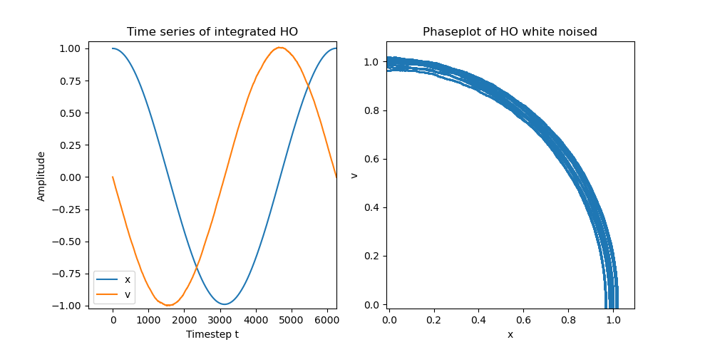
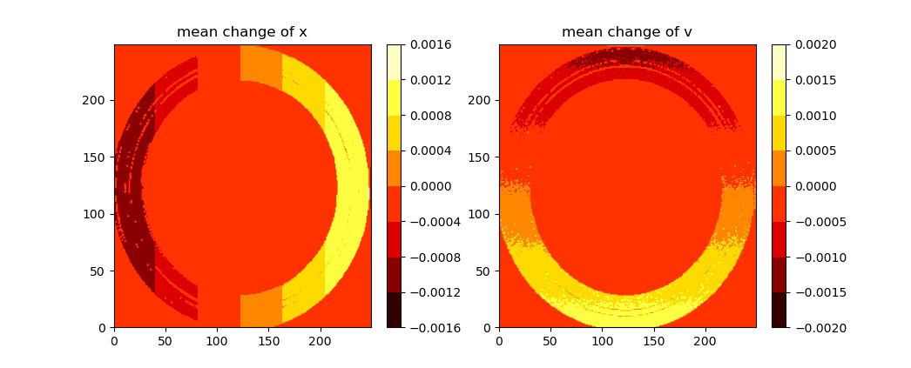
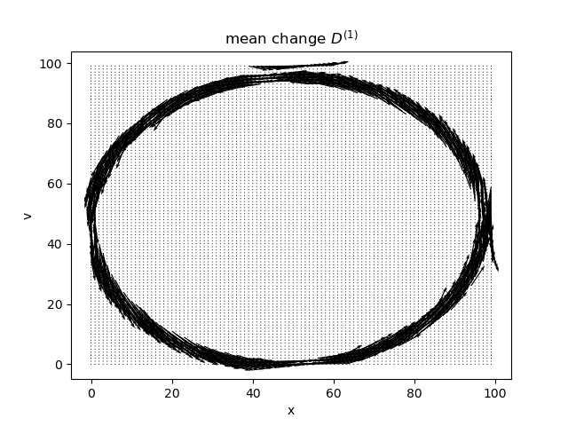
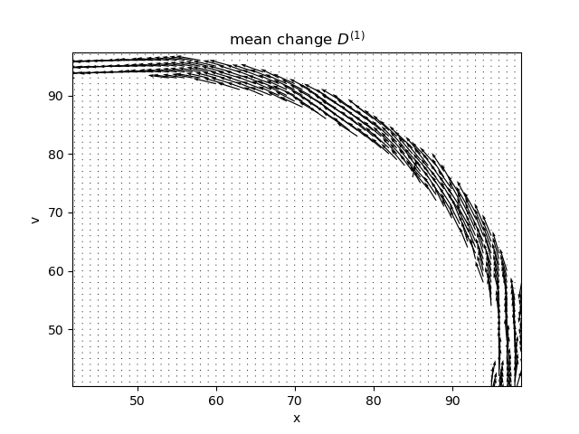
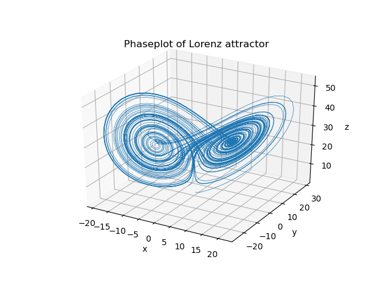
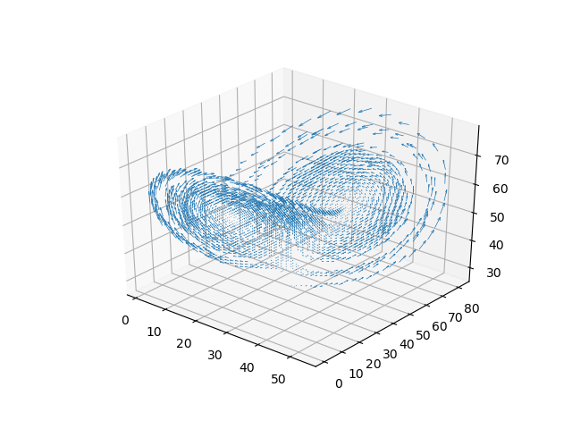
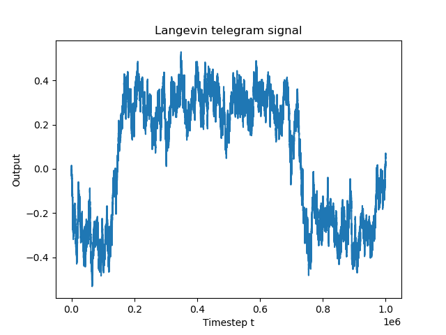
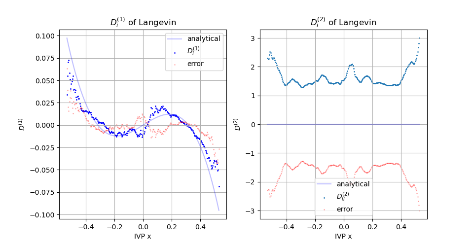

# StochasticAnalysis

## 1 Procedure
:warning: ```hardcoded``` This procedure has not been implemented yet to work with $n$-dimensions, but has been proofed for one, two and three dimensions.

### 1.1 create mesh to "underlay" the phaseplot with

```python
nx, ny = (250, 250)
xd = np.zeros(nx)
yd = np.zeros(ny)

x_bins, y_bins = np.meshgrid(xd, yd)
```

Where ```x_bins``` and ```y_bins ``` represent the meshs for the two dimensions. In the case of the harmonic oscillator, we need two meshs, because we have at every point on the phaseplot a mean ```x``` and a mean ```v```-change. They have the following structure, when initialized:

```python
[[0. 0. 0. ... 0. 0. 0.]
 [0. 0. 0. ... 0. 0. 0.]
 [0. 0. 0. ... 0. 0. 0.]
 ...
 [0. 0. 0. ... 0. 0. 0.]
 [0. 0. 0. ... 0. 0. 0.]
 [0. 0. 0. ... 0. 0. 0.]]
```

We also need counting meshs to count how often a bin has been visited by the phasplot:

```python
x_count, y_count = np.meshgrid(xd, yd)
```

### 1.2 Sampling the time series
First we want any ```x```, ```y``` value of the phase plot to be projected on an positive index of our mesh. Therefore we need to offset the values by the following:

```python
dx = np.max(x) - np.min(x) # "offset" x
dy = np.max(v) - np.min(v) # "offset" y
```

Secondly we want a transform-function to project the values. I chose the following:
$$
T_{d, b}(x) = (x+\frac{d}{2}) \cdot \lfloor \frac{b}{d} \rfloor - 1
$$
where $d$ represents the offset, and $b$ the number of bins on each axis.

```python
transform = lambda x, d, b: int((x + (d/2)) * np.floor(b / d)) - 1
```

Thirdly we can sample the series:

```python
tau = 1

for i in range(len(x[:-tau])):
    # 1. Transform x and y values of phase plot to meshgrid size.
    #    Retrieving the indexes to project to.
    xc = transform(x[i], dx, nx)
    yc = transform(v[i], dy, ny)
    # 2. Summate changes of the series and save it into mesh.
    #    Also save the number of visits in *_count meshes.
    #    This has to be done n-times for n-dimensions.
    x_bins[xc][yc] += x[i + tau] - x[i]
    y_bins[xc][yc] += v[i + tau] - v[i]
    x_count[xc][yc] += 1
    y_count[xc][yc] += 1

# Now calculate mean changes
for i in range(len(x_bins)):
    for j in range(len(x_bins[i])):
        x_bins[i][j] = 0 if x_count[i][j] == 0 else x_bins[i][j] / x_count[i][j]
        y_bins[i][j] = 0 if y_count[i][j] == 0 else y_bins[i][j] / y_count[i][j]
```

:warning: ```Note``` that the runtime in calculating the mean change is inefficient.

### 1.3 Enjoying the results

#### 1.3.1 HO
For ```x```, ```v``` of HO this yields the result:





This seems to be correctly: It's nearly the same characteristics, except it's turned by 90 degrees.

You also can plot this as a vector-field, via:

```python
# vector field
fig, ax = plt.subplots()
plt.title('mean change $D^{(1)}$')
ax.quiver(xd, yd, y_bins, x_bins)
plt.xlabel('x')
plt.ylabel('v')
plt.show()
```

Which reults in:



In closeup:



#### 1.3.2 Lorenz attractor
The same procedure can be applied to the Lorenz-attractor, with the following characteristics:



The calculation is a bit more complex due to it's dimensionality:

```python
for i in range(len(xs[:-tau])):
    # 1. Transform x and y values of phase plot to meshgrid size.
    #    Retrieving the indexes to project to.
    xc = transform(xs[i], dx, nx)
    yc = transform(ys[i], dy, ny)
    zc = transform(zs[i], dz, nz)
    # 2. Summate changes of the series and save it into mesh.
    #    Also save the number of visits in *_count meshes.
    #    This has to be done n-times for n-dimensions.
    x_bins[xc][yc][zc] += xs[i + tau] - xs[i]
    y_bins[xc][yc][zc] += ys[i + tau] - ys[i]
    z_bins[xc][yc][zc] += zs[i + tau] - zs[i]
    x_count[xc][yc][zc] += 1
    y_count[xc][yc][zc] += 1
    z_count[xc][yc][zc] += 1

# Now calculate mean changes
for i in range(len(x_bins)):
    for j in range(len(x_bins[i])):
        for k in range(len(x_bins[i][j])):
            x_bins[i][j][k] = 0 if x_count[i][j][k] == 0 else x_bins[i][j][k] / x_count[i][j][k]
            y_bins[i][j][k] = 0 if y_count[i][j][k] == 0 else y_bins[i][j][k] / y_count[i][j][k]
            z_bins[i][j][k] = 0 if z_count[i][j][k] == 0 else z_bins[i][j][k] / z_count[i][j][k]
```

But the results are even more beautiful:



#### 1.3.3 Langevin Telegram signal
For the Langevin telegram signal, the old 1D function can be used:



This results in:



### 1.4 But what about n-dimensions?
How do we create a n-dimensional function?

The problem is the ```np.meshgrid()``` function. Its usage is defined as:

```
numpy.meshgrid(*xi, copy=True, sparse=False, indexing='xy')

Return coordinate matrices from coordinate vectors.

Make N-D coordinate arrays for vectorized evaluations of N-D scalar/vector fields over N-D grids, given one-dimensional coordinate arrays x1, x2,…, xn.

Parameters
    x1, x2,…, xn: array_like
        1-D arrays representing the coordinates of a grid.

[...]
```

So e.g. if we have 35-dimensions, we need to execute as follows: ```np.meshgrid(x1, x2, ..., x35)```. There are some simplifications with library ```itertools``` possible or just by ```numpy.mgrid()```, but I have'nt looked into that yet.

> EDIT: Acutallly it'll work with ```np.mgrid()```. (s. https://numpy.org/doc/stable/reference/generated/numpy.mgrid.html)

### 1.5 Reconstruction of time series
tba.