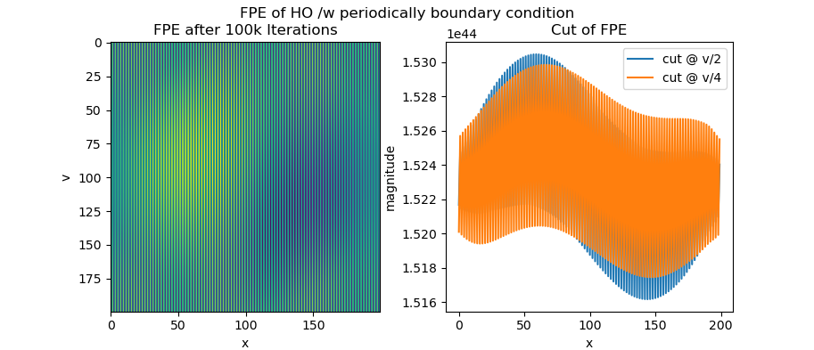

# Fokker-Planck Equation on harmonic- and Van-der-Pol oscillator

## Harmonic oscillator
The FPE is euler-integrated. This is done the following way:

```python
dt = .1
gamma = .01
c = 1.0
k = 1.0
m = 1.0

for i in np.arange(100000):
    dwdx = (np.roll(wxv, -1, 1) - np.roll(wxv, 1, 1)) / 2.
    dwdv = (np.roll(wxv, -1, 0) - np.roll(wxv, 1, 0)) / 2.
    d2wdv2 = np.roll(wxv, -1, 0) - 2. * wxv + np.roll(wxv, 1, 0)
    # boundary condition 0
    wxv[1:-2,1:-2] = ((1.0 + gamma * dt) * wxv - v * dwdx * dt + (x + gamma * v) * dwdv * dt + c * d2wdv2 * dt)[1:-2,1:-2]
    # no boundary condition
    #wxv = ((1.0 + gamma * dt) * wxv - v * dwdx * dt + (x + gamma * v) * dwdv * dt + c * d2wdv2 * dt)  
```

We use the following initial condition of $w(x, v, t) = p(x, v, t)$:


Setting the boundaries to zero this yields the following (via ```plt.imshow```):


Using periodical bpundary conditions, we receive bullsh*t. So we may not set periodical boundary conditions.



## Van-der-Pol oscillator
$$
\dot{x} = v
\\
\dot{v} = \mu ( 1 - x ^ 2 ) v - \omega ^ 2 x
\\
\text{where } \mu = \omega = 1
$$

We use this code-snippet to integrate for the VdP oscillator:

```python
dt = .1
gamma = 0.01

c = 1.0
mu = 2

for i in np.arange(100000):
    if i % 1000 == 0 or (i < 2000 and i % 100 == 0):
        frames.append(wxv * 1)
    dwdx = (np.roll(wxv, -1, 1) - np.roll(wxv, 1, 1)) / 2.
    dwdv = (np.roll(wxv, -1, 0) - np.roll(wxv, 1, 0)) / 2.
    d2wdv2 = np.roll(wxv, -1, 0) - 2. * wxv + np.roll(wxv, 1, 0)

    wxv[1:-2,1:-2] = ((1.0 + gamma * (mu*(1-x**2)) * dt) * wxv - dwdx * v * dt - dwdv * (mu * (1 - x ** 2) * v - x) * dt\
                      + c * d2wdv2 * dt)[1:-2,1:-2]
```

The initial conditions are set to:


Yielding the following result (via ```plt.contourf```):


With some special code, we can animate the integration process:

